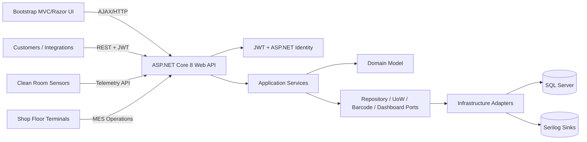
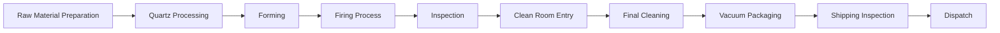

# AWQP Solution Architecture

## Architecture goals

AWQP is designed as a modular monolith that is microservice-ready. Each module owns its domain model, API boundary, and persistence concepts while sharing platform capabilities such as identity, audit, logging, validation, and observability. The solution follows Clean Architecture:

1. **Domain**: Entities, enums, invariants, and process concepts.
2. **Application**: DTOs, validators, use-case services, and ports.
3. **Infrastructure**: EF Core, SQL Server, Identity, JWT, repositories, unit of work, QR/barcode services.
4. **Presentation**: REST APIs and MVC/Razor UI.

## High-level architecture

## Module decomposition

| Module | Responsibilities | Key tables |
| --- | --- | --- |
| Authentication & Authorization | JWT, refresh tokens, password policy, RBAC, user activity audit | `auth.Users`, `auth.Roles`, `auth.RefreshTokens`, `erp.UserActivityAudits` |
| Customer Management | profiles, contacts, addresses, industry segments, documents | `Customers`, `CustomerContacts`, `CustomerAddresses`, `CustomerIndustries` |
| Product Management | categories, specs, material grades, drawings, revisions, ECR | `Products`, `ProductSpecifications`, `ProductRevisions`, `EngineeringDrawings` |
| Sales | RFQ, quotation, approval, sales order | `RequestForQuotes`, `Quotations`, `SalesOrders`, `SalesApprovals` |
| Production Planning | schedules, resource allocation, shifts, machines | `ProductionSchedules`, `ResourceAllocations`, `Machines`, `Shifts` |
| MES | 10-stage manufacturing execution with yield capture | `WorkOrders`, `ManufacturingOperations` |
| QMS | inspections, defect, NCR, CAPA, RCA | `InspectionRecords`, `Defects`, `NonConformanceReports`, `CorrectivePreventiveActions` |
| Clean Room | temperature, humidity, particle count, access, compliance | `CleanRoomAreas`, `CleanRoomEnvironmentalReadings`, `CleanRoomAccessLogs` |
| Inventory/Warehouse | stock, movements, bins, barcode/QR | `InventoryItems`, `InventoryTransactions`, `WarehouseLocations` |
| Packaging/Shipping | vacuum validation, shipping inspection, dispatch, tracking | `VacuumPackagingRecords`, `ShippingInspections`, `Shipments` |
| Traceability | serial, batch, lot, genealogy events | `ProductSerials`, `ProductGenealogyLinks`, `TraceabilityEvents` |
| Documents | SOPs, drawings, reports, certificates | `ManagedDocuments` |

## Microservice-ready seams

The following bounded contexts can be extracted independently when operational scale requires it:

- Identity service
- Customer/product master data service
- Sales/order service
- Production/MES service
- Quality service
- Clean-room telemetry service
- Inventory/warehouse service
- Shipping service
- Traceability service
- Document service

Extraction path: replace repository implementations with service clients, publish domain events from application services, and isolate each bounded context database schema.

## Security architecture

- JWT access tokens with refresh token rotation.
- ASP.NET Core Identity for users, roles, password policy, lockout, and secure password hashing.
- Role policies for production, quality, clean room, and warehouse workflows.
- API authorization at controller/action level.
- User activity audit middleware records authenticated API activity.
- EF `SaveChangesAsync` writes entity audit logs with old/new values.

## Observability

- Serilog request logging and structured application logging.
- SQL Server audit tables for regulated manufacturing traceability.
- Clean-room environmental readings persisted with compliance calculation.
- Dashboard views provide SQL-side operational summaries.

## Production workflow

After firing, every operation from final inspection onward is modeled as clean-room controlled work with environmental and access-control evidence.
