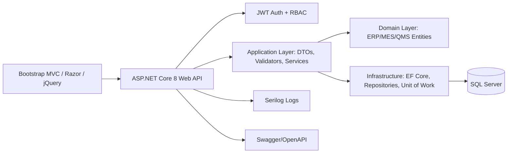

# AWQP Semiconductor Quartz ERP/MES Architecture

## Solution Architecture

The system is organized as a modular monolith with microservice-ready boundaries. Each domain module owns its entities, application services, API contracts, authorization policies, and data access rules. The current deployment is a single ASP.NET Core API and MVC web front end; modules can later be extracted behind asynchronous integration events.



## Clean Architecture Folder Structure

```text
src/
  AWQP.Domain/          Entities, enums, base classes
  AWQP.Application/     DTOs, validators, interfaces, mapping
  AWQP.Infrastructure/  EF Core DbContext, repositories, unit of work, services
  AWQP.Api/             REST controllers, JWT auth, middleware, Swagger
  AWQP.Web/             MVC screens, Razor views, Bootstrap/jQuery dashboards
database/               SQL Server schema, seed data, views, procedures, triggers
docs/                   Architecture, ERD, workflow, deployment guidance
.azure-pipelines/       Azure DevOps CI/CD
```

## Low-Level Design

- Controllers expose RESTful endpoints and enforce role policies.
- Application services model use cases: customer onboarding, work order execution, QMS inspection, clean room monitoring, dashboards, and traceability.
- Repositories expose aggregate persistence through EF Core and Unit of Work coordinates transactional commits.
- Domain entities preserve manufacturing genealogy across serial, lot, batch, work order, operation, inspection, packaging, and shipment records.
- Audit fields are maintained in `ManufacturingDbContext.SaveChangesAsync`; activity audit entities support user-level event history.

## Primary API Endpoints

| Module | Endpoint | Purpose |
| --- | --- | --- |
| Authentication | `POST /api/auth/login` | JWT login |
| Authentication | `POST /api/auth/register` | Admin user provisioning |
| Customers | `GET /api/customers` | Customer profile list |
| Customers | `POST /api/customers` | Customer creation |
| Products | `GET /api/products` | Product and specification catalog |
| Products | `POST /api/products/revisions` | Drawing/revision tracking |
| Sales | `POST /api/sales/rfqs` | RFQ capture |
| Sales | `POST /api/sales/quotations` | Quotation and approval workflow input |
| Sales | `POST /api/sales/orders` | Sales order creation |
| MES | `POST /api/mes/work-orders` | Create work order and 10-stage route |
| MES | `POST /api/mes/operations/start` | Start manufacturing operation |
| MES | `POST /api/mes/operations/complete` | Complete operation and capture yield |
| Traceability | `GET /api/mes/traceability/{serialNumber}` | Complete genealogy |
| QMS | `POST /api/qms/inspections` | Inspection record with parameters |
| Inventory | `GET /api/inventory/stock` | Current warehouse/bin stock |
| Inventory | `POST /api/inventory/transactions` | Receipt, issue, transfer, adjustment history |
| Clean Room | `POST /api/clean-rooms/readings` | Temperature, humidity, particle count |
| Shipping | `POST /api/shipping/packaging-batches` | Vacuum packaging validation |
| Shipping | `POST /api/shipping/shipments` | Dispatch and shipment tracking |
| Documents | `GET /api/documents` | SOPs, drawings, reports, certificates |
| Dashboards | `GET /api/dashboards/executive` | Production, quality, inventory, clean room, shipping metrics |
| Codes | `GET /api/codes/barcode/{value}` | Code128 PNG |
| Codes | `GET /api/codes/qr/{value}` | QR PNG |

## Authorization Matrix

| Role | Capabilities |
| --- | --- |
| Admin | Full access and user provisioning |
| Production Manager | Planning, work order release, dashboards |
| Production Engineer | MES operation execution and traceability |
| Quality Engineer | QMS, NCR, CAPA, final inspection |
| Clean Room Operator | Clean room entry, final cleaning, packaging readings |
| Warehouse Staff | Inventory, warehouse, barcode/QR operations |
| Sales Team | RFQ, quotation, sales order, customer management |
| Customer | Customer-facing order/shipment visibility |
```
