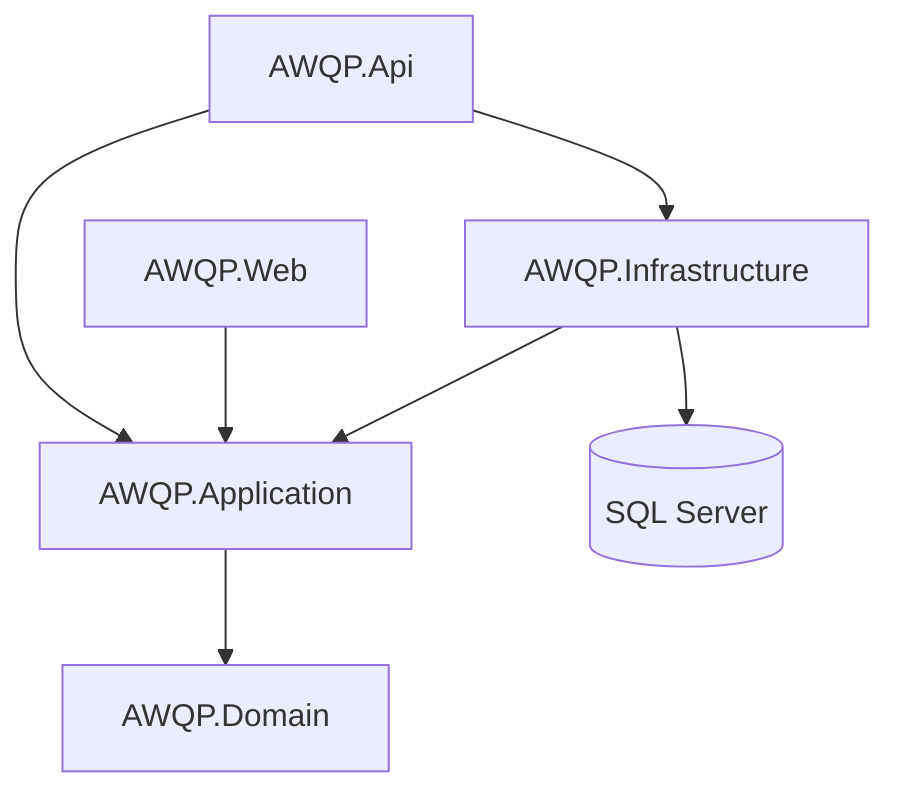
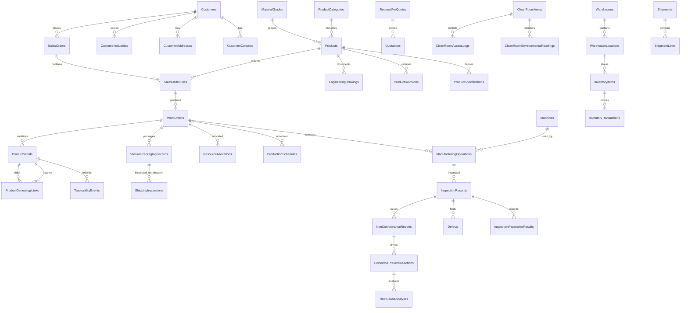
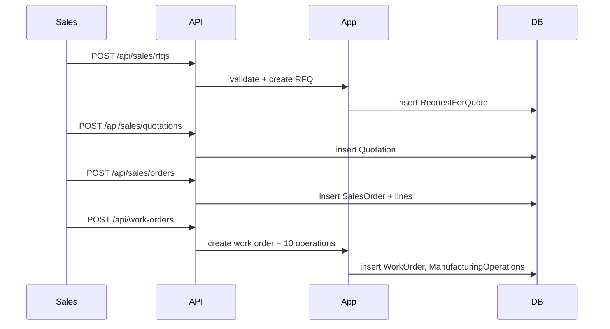
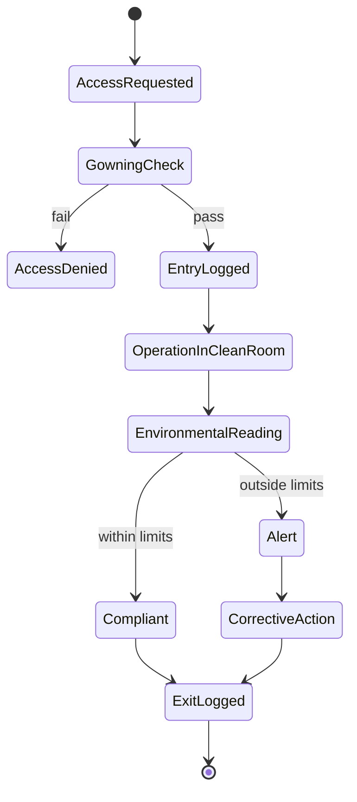
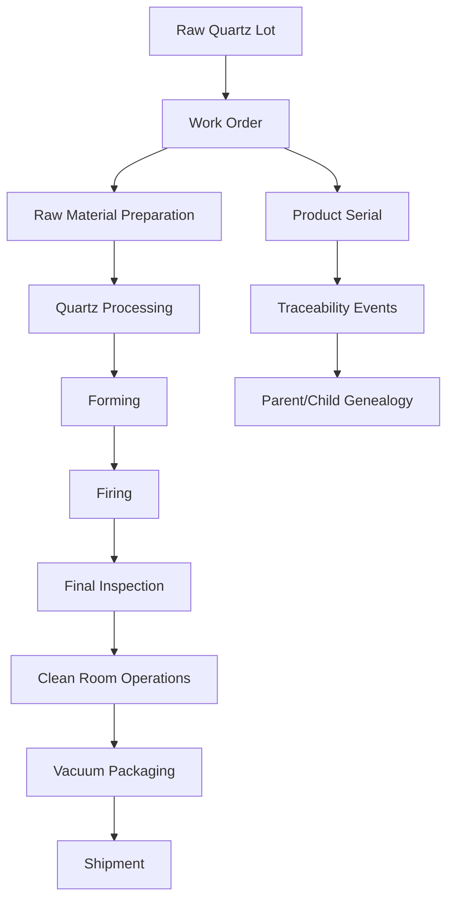

# Diagrams

## Clean Architecture dependency diagram

```mermaid
flowchart TD
    Api[AWQP.Api] --> Application[AWQP.Application]
    Web[AWQP.Web] --> Application
    Infrastructure[AWQP.Infrastructure] --> Application
    Application --> Domain[AWQP.Domain]
    Api --> Infrastructure
    Infrastructure --> Sql[(SQL Server)]
```

## ER diagram

```mermaid
erDiagram
    Customers ||--o{ CustomerContacts : has
    Customers ||--o{ CustomerAddresses : has
    Customers ||--o{ CustomerIndustries : serves
    Customers ||--o{ SalesOrders : places
    ProductCategories ||--o{ Products : classifies
    MaterialGrades ||--o{ Products : grades
    Products ||--o{ ProductSpecifications : defines
    Products ||--o{ ProductRevisions : versions
    Products ||--o{ EngineeringDrawings : documents
    Products ||--o{ SalesOrderLines : ordered
    SalesOrders ||--o{ SalesOrderLines : contains
    RequestForQuotes ||--o{ Quotations : quoted
    SalesOrderLines ||--o{ WorkOrders : produces
    WorkOrders ||--o{ ManufacturingOperations : executes
    WorkOrders ||--o{ ProductionSchedules : scheduled
    WorkOrders ||--o{ ResourceAllocations : allocated
    Machines ||--o{ ManufacturingOperations : used_by
    ManufacturingOperations ||--o{ InspectionRecords : inspected
    InspectionRecords ||--o{ InspectionParameterResults : records
    InspectionRecords ||--o{ Defects : finds
    InspectionRecords ||--o{ NonConformanceReports : raises
    NonConformanceReports ||--o{ CorrectivePreventiveActions : drives
    CorrectivePreventiveActions ||--o{ RootCauseAnalyses : analyzes
    CleanRoomAreas ||--o{ CleanRoomEnvironmentalReadings : monitors
    CleanRoomAreas ||--o{ CleanRoomAccessLogs : controls
    Warehouses ||--o{ WarehouseLocations : contains
    WarehouseLocations ||--o{ InventoryItems : stores
    InventoryItems ||--o{ InventoryTransactions : moves
    WorkOrders ||--o{ VacuumPackagingRecords : packages
    VacuumPackagingRecords ||--o{ ShippingInspections : inspected_for_dispatch
    Shipments ||--o{ ShipmentLines : contains
    WorkOrders ||--o{ ProductSerials : serializes
    ProductSerials ||--o{ TraceabilityEvents : records
    ProductSerials ||--o{ ProductGenealogyLinks : parent
    ProductSerials ||--o{ ProductGenealogyLinks : child
```

## API sequence for RFQ to production

```mermaid
sequenceDiagram
    participant Sales
    participant API
    participant App
    participant DB
    Sales->>API: POST /api/sales/rfqs
    API->>App: validate + create RFQ
    App->>DB: insert RequestForQuote
    Sales->>API: POST /api/sales/quotations
    API->>DB: insert Quotation
    Sales->>API: POST /api/sales/orders
    API->>DB: insert SalesOrder + lines
    Sales->>API: POST /api/work-orders
    API->>App: create work order + 10 operations
    App->>DB: insert WorkOrder, ManufacturingOperations
```

## Clean-room compliance workflow

```mermaid
stateDiagram-v2
    [*] --> AccessRequested
    AccessRequested --> GowningCheck
    GowningCheck --> AccessDenied: fail
    GowningCheck --> EntryLogged: pass
    EntryLogged --> OperationInCleanRoom
    OperationInCleanRoom --> EnvironmentalReading
    EnvironmentalReading --> Compliant: within limits
    EnvironmentalReading --> Alert: outside limits
    Compliant --> ExitLogged
    Alert --> CorrectiveAction
    CorrectiveAction --> ExitLogged
    ExitLogged --> [*]
```

## Traceability genealogy

```mermaid
flowchart TD
    Raw[Raw Quartz Lot] --> WO[Work Order]
    WO --> Op1[Raw Material Preparation]
    Op1 --> Op2[Quartz Processing]
    Op2 --> Op3[Forming]
    Op3 --> Op4[Firing]
    Op4 --> Op5[Final Inspection]
    Op5 --> CR[Clean Room Operations]
    CR --> Pack[Vacuum Packaging]
    Pack --> Ship[Shipment]
    WO --> Serial[Product Serial]
    Serial --> Events[Traceability Events]
    Events --> Genealogy[Parent/Child Genealogy]
```
