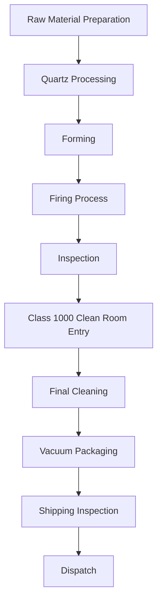
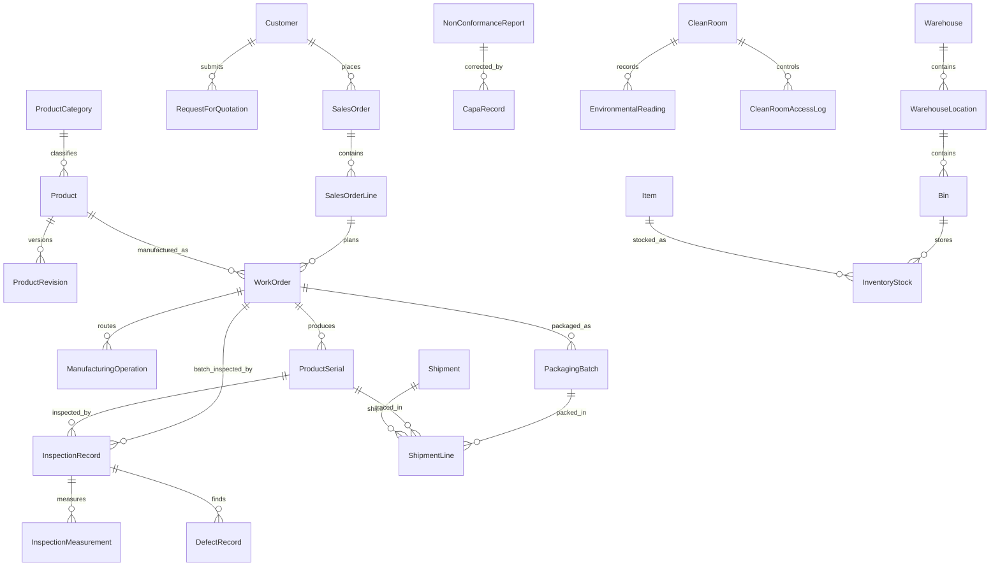
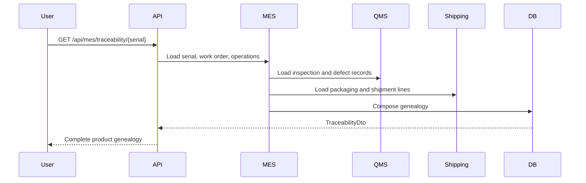
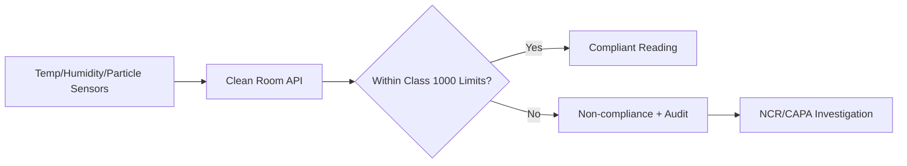

# UML, ER, and Workflow Diagrams

## Production Workflow

```mermaid
flowchart TD
    A[Raw Material Preparation] --> B[Quartz Processing]
    B --> C[Forming]
    C --> D[Firing Process]
    D --> E[Inspection]
    E --> F[Class 1000 Clean Room Entry]
    F --> G[Final Cleaning]
    G --> H[Vacuum Packaging]
    H --> I[Shipping Inspection]
    I --> J[Dispatch]
```

## ER Diagram

```mermaid
erDiagram
    Customer ||--o{ SalesOrder : places
    Customer ||--o{ RequestForQuotation : submits
    ProductCategory ||--o{ Product : classifies
    Product ||--o{ ProductRevision : versions
    Product ||--o{ WorkOrder : manufactured_as
    SalesOrder ||--o{ SalesOrderLine : contains
    SalesOrderLine ||--o{ WorkOrder : plans
    WorkOrder ||--o{ ManufacturingOperation : routes
    WorkOrder ||--o{ ProductSerial : produces
    ProductSerial ||--o{ InspectionRecord : inspected_by
    WorkOrder ||--o{ InspectionRecord : batch_inspected_by
    InspectionRecord ||--o{ InspectionMeasurement : measures
    InspectionRecord ||--o{ DefectRecord : finds
    NonConformanceReport ||--o{ CapaRecord : corrected_by
    CleanRoom ||--o{ EnvironmentalReading : records
    CleanRoom ||--o{ CleanRoomAccessLog : controls
    WorkOrder ||--o{ PackagingBatch : packaged_as
    Shipment ||--o{ ShipmentLine : ships
    ProductSerial ||--o{ ShipmentLine : traced_in
    PackagingBatch ||--o{ ShipmentLine : packed_in
    Warehouse ||--o{ WarehouseLocation : contains
    WarehouseLocation ||--o{ Bin : contains
    Item ||--o{ InventoryStock : stocked_as
    Bin ||--o{ InventoryStock : stores
```

## Traceability Sequence

```mermaid
sequenceDiagram
    participant User
    participant API
    participant MES
    participant QMS
    participant Shipping
    participant DB
    User->>API: GET /api/mes/traceability/{serial}
    API->>MES: Load serial, work order, operations
    MES->>QMS: Load inspection and defect records
    MES->>Shipping: Load packaging and shipment lines
    MES->>DB: Compose genealogy
    DB-->>API: TraceabilityDto
    API-->>User: Complete product genealogy
```

## Clean Room Compliance Flow

```mermaid
flowchart LR
    Sensor[Temp/Humidity/Particle Sensors] --> API[Clean Room API]
    API --> Rule{Within Class 1000 Limits?}
    Rule -->|Yes| Compliant[Compliant Reading]
    Rule -->|No| Alert[Non-compliance + Audit]
    Alert --> QMS[NCR/CAPA Investigation]
```
